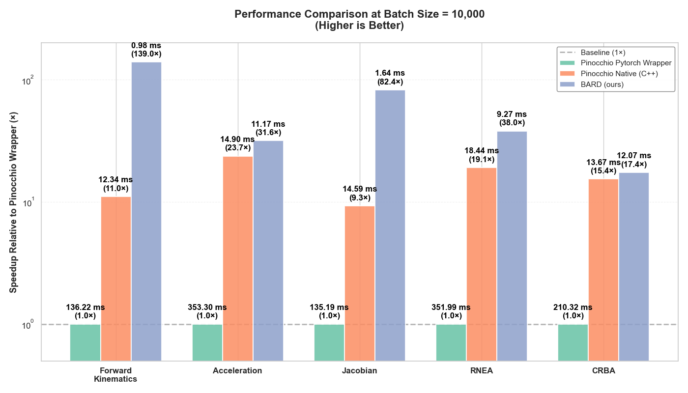

# bard: Batched Articulated Robot Dynamics

[](https://github.com/YueWang996/bard/actions)
[](https://opensource.org/licenses/MIT)
[](https://github.com/YueWang996/bard)
[](https://doi.org/10.5281/zenodo.17291122)

<p align="center">
  
</p>

`bard` is a lightweight, PyTorch-native library for rigid-body dynamics that leverages tensor operations to perform efficient, batched computations on either the CPU or GPU. It provides a simple yet powerful API for loading robots from URDF files and analyzing their motion using standard robotics algorithms.

The primary motivation behind `bard` is to provide a dynamics library that integrates seamlessly into modern machine learning workflows. By treating the robot's state and dynamics as a differentiable computation graph, it becomes an ideal tool for robotics research in areas like reinforcement learning, trajectory optimization, physics-informed learning, and system identification.

## Feature Comparison ✨

`bard` combines the best of both worlds: native PyTorch integration for ML workflows and comprehensive robotics algorithms. Here's how it compares to other state-of-the-art libraries:


| Feature | bard (Ours) | Pinocchio | RBDL | pytorch_kinematics |
|---------|:------:|:-----------:|:------:|:-------------------:|
| **PyTorch Native** | ✅ | ❌ | ❌ | ✅ |
| **Batch Processing** | ✅ | ❌ | ❌ | ✅ |
| **GPU Acceleration** | ✅ | ❌ | ❌ | ✅ |
| **Auto-Differentiation (Autograd)** | ✅ | ❌ | ❌ | ✅ |
| **Floating-Base Support** | ✅ | ✅ | ✅ | ❌ |
| **Forward Kinematics** | ✅ | ✅ | ✅ | ✅ |
| **Inverse Kinematics** | ❌ | ✅ | ✅ | ✅ |
| **Jacobian Calculation** | ✅ | ✅ | ✅ | ✅ |
| **Inverse Dynamics (RNEA)** | ✅ | ✅ | ✅ | ❌ |
| **Forward Dynamics (ABA)** | ✅ | ✅ | ✅ | ❌ |
| **Mass Matrix (CRBA)** | ✅ | ✅ | ✅ | ❌ |
| **URDF Parsing** | ✅ | ✅ | ✅ | ✅ |


**Key Advantages of bard:**
- Seamlessly integrates with PyTorch-based ML pipelines
- Efficient batched operations for training neural networks with thousands of parallel simulations
- Full differentiability through robot dynamics for gradient-based optimization
- Native GPU support without requiring C++/CUDA compilation

## Quick Start

### Basic Usage (Cached Workflow)

`bard` follows a **model + data** pattern inspired by Pinocchio and MuJoCo. Build a model once, create a data workspace, then call top-level functions for all computations. A single `update_kinematics()` call caches shared quantities, eliminating redundant tree traversals.

```python
import torch
import bard

# Build model and create data workspace
model = bard.build_model_from_urdf("robot.urdf", floating_base=True)
model.to(dtype=torch.float32, device="cuda")
data = bard.create_data(model, max_batch_size=4096)

eef_id = model.get_frame_id("end_effector_link")

# In your control / RL training loop:
# 1. Single tree traversal — caches everything
bard.update_kinematics(model, data, q, qd)

# 2. All algorithms reuse cached data (no redundant computation)
T_eef = bard.forward_kinematics(model, data, eef_id)          # O(1) lookup
J     = bard.jacobian(model, data, eef_id, reference_frame="world")
tau   = bard.rnea(model, data, qdd, gravity=gravity)
M     = bard.crba(model, data)
qdd   = bard.aba(model, data, tau, gravity=gravity)            # Forward dynamics
```

### Standalone FK (No Cache Needed)

For single-frame queries without needing a full tree traversal:

```python
T = bard.forward_kinematics(model, data, frame_id, q=q)  # Path-only traversal
```

## Benchmarks 🚀

`bard` is designed for high performance, especially when processing large batches of robot states on GPU. The benchmark below compares the computational speed of `bard` against Pinocchio for common robotics operations on a Unitree Go2 robot model. All `bard` computations were executed on an NVIDIA H200 GPU, while Pinocchio benchmarks include both its native C++ implementation (CPU) and PyTorch wrapper (GPU CUDA).



## Installation

We strongly recommend using the **Conda** package manager to create an isolated environment. This simplifies the management of complex dependencies like PyTorch and Pinocchio (for testing).

First, clone the repository:

```bash
# create a conda environment
conda create -n yourEnv

# clone the repo
git clone https://github.com/YueWang996/bard.git
cd bard
```

Next, follow the instructions for your desired compute device.

### Option 1: CUDA Installation (Recommended for GPU Acceleration)

1.  Install a CUDA-enabled build of PyTorch by following the official instructions for your specific platform and CUDA version:
    [https://pytorch.org/get-started/locally/](https://pytorch.org/get-started/locally/)
    > **Note:** `bard` has been tested against `PyTorch 2.8.0` and `CUDA 12.6`. If you encounter any errors, we recommend switching to these package versions to resolve potential issues.

2.  Once PyTorch is installed, install `bard`:

    ```bash
    pip install -e .
    ```

### Option 2: CPU-Only Installation

If you do not have an NVIDIA GPU or do not require GPU acceleration, you can install the CPU-only version with a single command. This will automatically install a compatible, CPU-only version of PyTorch.

```bash
pip install -e ".[cpu]"
```

### Upgrading from CPU to GPU

If you initially installed the CPU-only version and want to switch to the CUDA version, you must manually reinstall PyTorch.

1.  Uninstall the existing CPU-only PyTorch version:

    ```bash
    pip uninstall -y torch torchvision
    ```

2.  Install the correct CUDA-enabled PyTorch build from the [official site](https://pytorch.org/get-started/locally/).

3.  Reinstall `bard` to ensure all dependencies are correctly linked.

    ```bash
    pip install -e . --force-reinstall
    ```

### Building the Documentation

The documentation is available [here](https://yuewang996.github.io/bard-pytorch-dynamics/). If you need to build the documentation locally, follow these steps.

1.  **Install documentation dependencies** from the project's root directory:
    ```bash
    pip install -e ".[docs]"
    ```
2.  **Navigate to the `docs` folder and run the build command**:
    ```bash
    cd docs
    sphinx-build -b html source build/html
    ```
3.  **View the documentation** by opening the `index.html` file located in the `docs/build/html/` directory in your web browser.

## Running Tests

The library is rigorously tested against `pinocchio` to ensure numerical accuracy. To run the full test suite, you will need to install the development dependencies, including `pinocchio`, which is best installed from `conda-forge`.

```bash
# First, install pinocchio
conda install -c conda-forge pinocchio

# From the project root directory, install dev dependencies
pip install -e ".[dev]"

# Run the test suite
pytest
```

## Citing bard

If you use `bard` in your research, please consider citing it:

```bibtex
@software{wang_2025_bard,
  author       = {Wang, Yue},
  title        = {{bard: Batched Articulated Robot Dynamics}},
  month        = oct,
  year         = {2025},
  doi          = {10.5281/zenodo.17291122},
  url          = {https://github.com/YueWang996/bard}
}
```


## Acknowledgements

This library builds upon the excellent work of several other open-source projects.

  * The core `bard/transforms` module is adapted from **`pytorch3d`**. This approach was chosen to avoid including the entirety of `pytorch3d` as a dependency. An important difference is that `bard` uses left-multiplied transforms (`T * pt`), which is the standard convention in robotics, as opposed to `pytorch3d`'s right-multiplied convention.
  * The `bard/parsers/urdf_parser_py` module is extracted from **`kinpy`**.
  * This project is heavily inspired by the structure and API of **`pytorch_kinematics`**, from which some of the components were adapted.
  * Numerical results are validated against **`pinocchio`**.

## License

This project is licensed under the MIT License.
